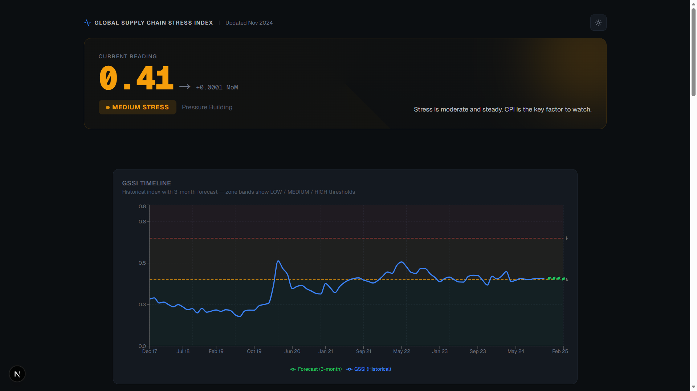

# GSSI – Global Supply Chain Stress Index

A real-time supply chain stress monitoring and forecasting platform. Combines 7 macroeconomic signals into a single composite index (GSSI) and forecasts near-term stress trends to guide portfolio allocation.



## Tech Stack

| Layer    | Stack                                      |
|----------|--------------------------------------------|
| Frontend | Next.js 16, React 19, TypeScript, Recharts |
| Backend  | Flask, pandas, scikit-learn                |
| Data     | FRED API (fredapi)                         |

## Signals

| Signal                  | FRED ID     | Weight |
|-------------------------|-------------|--------|
| Freight Transport Index | TSIFRGHT    | 20%    |
| WTI Crude Oil           | DCOILWTICO  | 15%    |
| CPI                     | CPIAUCSL    | 15%    |
| PPI                     | PPIACO      | 15%    |
| VIX                     | VIXCLS      | 15%    |
| US Imports              | IMPGSC1     | 10%    |
| Manufacturing Employment| MANEMP      | 10%    |

All signals are normalized to [0, 1]. Freight, imports, and manufacturing are inverted so that higher values always indicate more stress.

## Stress Zones

- **LOW** (GSSI < 0.40) — Normal conditions
- **MEDIUM** (0.40–0.65) — Pressure building
- **HIGH** (≥ 0.65) — Crisis incoming

Each zone maps to portfolio recommendations (defensive positioning, balanced allocation, or risk-on).

## Forecasting

A two-stage residual model predicts GSSI 3 months forward:

1. Component-level HuberRegressor models predict each signal's deviation from its EWMA baseline
2. Forecasted signals are recombined into a GSSI forecast
3. Walk-forward cross-validation ensures the model beats naive baselines (RAE < 1)

## API Endpoints

| Endpoint         | Method | Description                          |
|------------------|--------|--------------------------------------|
| `/pipeline/run`  | POST   | Fetch data, compute GSSI, train model|
| `/gssi`          | GET    | Historical GSSI with stress zones    |
| `/forecast`      | GET    | 3-month forward forecast             |
| `/dashboard`     | GET    | All dashboard data in one call       |

## Getting Started

### Backend

```bash
cd backend
pip install -r requirements.txt
# Set FRED_API_KEY in .env
python app.py
```

### Frontend

```bash
cd my-app
npm install
npm run dev
```

Run the pipeline first via `POST /pipeline/run`, then open the dashboard at `http://localhost:3000`.
